# 改进的北邮图书馆推荐系统介绍
## 核心算法
在图书推荐系统中，我们使用的核心算法是基于用户的**协同过滤算法（User-CF）**。User-CF是推荐系统应用最广泛的算法。我们在对北邮读者借阅行为的数据挖掘的基础上，在数据处理和算法构建两个方面进行了相应改进，并在研究基础上提出了一种用于实践的北邮图书馆推荐系统架构和一个推荐服务策略。
## 推荐算法改进
### User-CF算法的改进
#### 算法介绍
User-CF算法的原理是通过以下**余弦相似度公式**计算不同读者对项目兴趣的相似度：

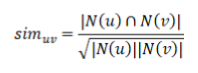

通过以下公式用来计算用户u对某物品i的感兴趣程度：

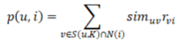

在为用户获得所有书籍的p值倒排顺序列表之后，选择用户尚未阅读的书籍并推荐给他。
### 改进
#### 1.构建兴趣相似度计算矩阵
本文通过对读者u的操作进行加权，得出了一本书对读者的操作权重。设U（i）是读者u在书i上执行的所有操作的列表，公式为：

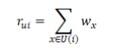

对于用户v，我们初步提出了用于计算感兴趣度的方程式:

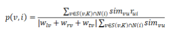

#### 2.用户兴趣相似度和书中用户兴趣的计算方法
这里使用了调整余弦相似度公式。对于用户u和用户v，具体公式如下： 

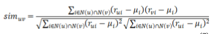

基于考虑均值的KNN算法，构造一种计算兴趣度的方法，如下所示:

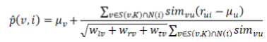

#### 3.离线实验
本文使用**RMSE、MAE、预测准确度、召回率和覆盖率**来衡量推荐系统的预测准确性。这里展示预测准确度、召回率和覆盖率。

设U是用户集合，R（u）是给用户u的推荐书列表，而T（u）是用户在测试集中的书籍列表，N 是所有图书的数量，而p（i，j）是按所有图书的受欢迎程度排序的第j本书的受欢迎程度。计算方法如下：

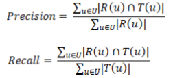

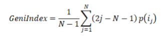

最后本文本文算法的**最佳预测准确度为26.59％**， **比余弦相似度优5.02％**，**比Pearson算法优 5.90％**。**最佳召回率为 43.83％**，比**pearson算法好 11.53％**，**比余弦相似度算法优 23.67％**。 **最佳覆盖率为37.31％**，**比余弦相似度算法高 7.82％**，**比皮尔逊算法高5.03％**。 

## 数据分析
首先我们对几个变量做出定义。以下的a代表读者借阅书籍次数，b代表续借次数。

#### 读者的活跃度

读者操作的加权和。读者的活跃度定义如下：

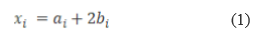

#### 读者的续借率
代表读者对一本书或某类书籍的热爱。读者的续借率如下：

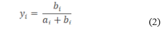

#### 冷门偏好程度
如果读者的借阅书目数量m中的n个是冷门书籍，那么他的冷门偏好程度为： 

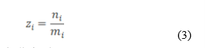

### 部分分析结果
#### 读者活动分布分析
书籍流行度分布呈长尾分布：

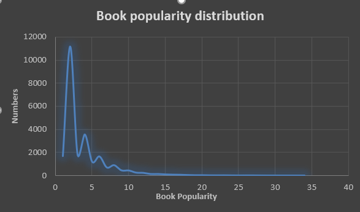

书籍流行度和用户活跃度分布关系：

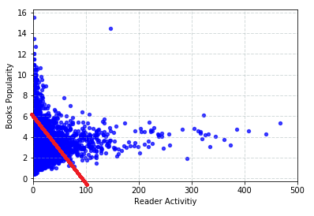

由于样本中，读者操作的覆盖率非常低。因此，那些不经常使用图书馆的读者故意寻找的低热书籍很可能被忽视。这些用户被称为冷门发现者。
#### 读者借阅数量分布分析
 三个不同用户的聚类中心是蓝色\[2.00，668.00]，绿色\[6.00,280.40]和红色\[59.00，15.88]。蓝色：大多数只借阅一本书的用户；绿色:借阅书籍的数量在2到10之间的读者，以及借阅活动频繁的红色读者。以下是用户活跃度分布：
  
 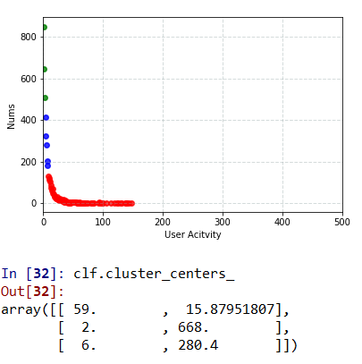

